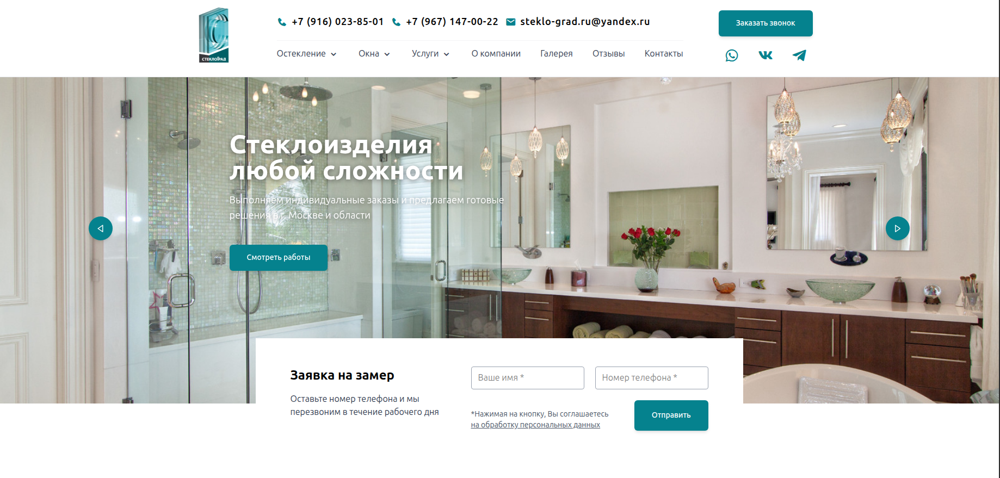
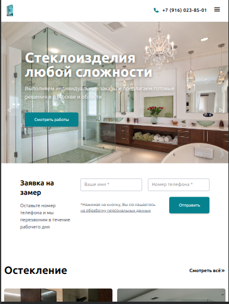
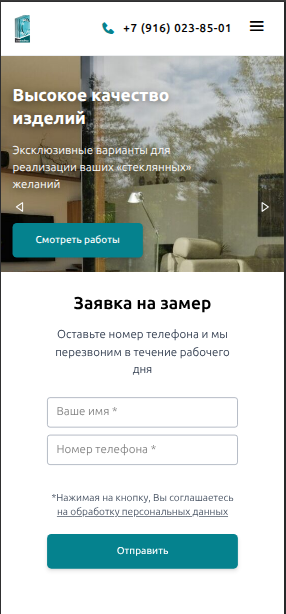
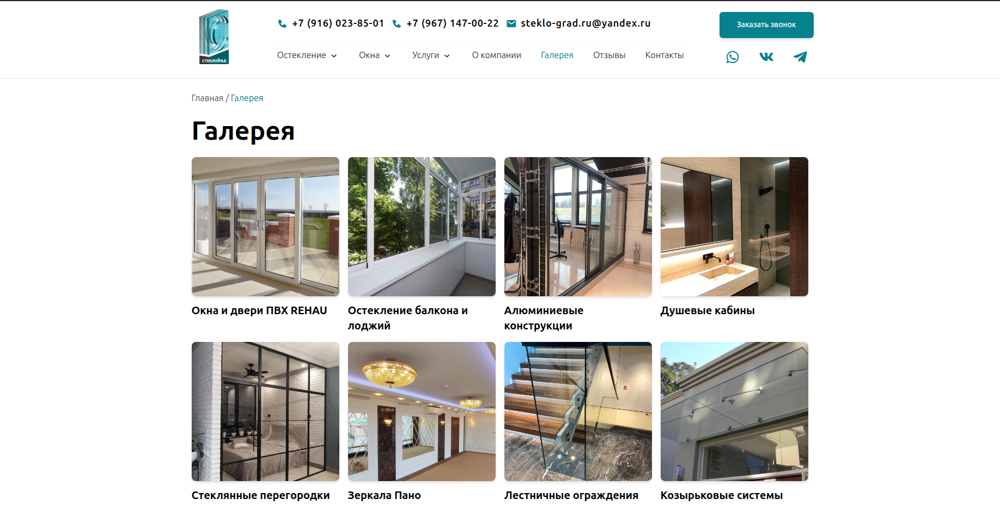
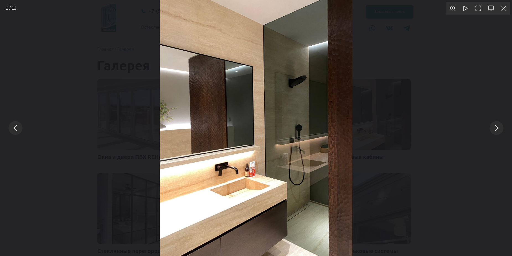
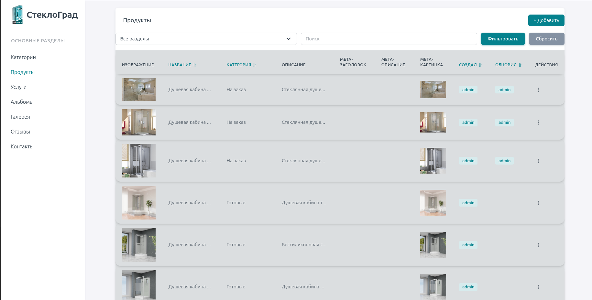
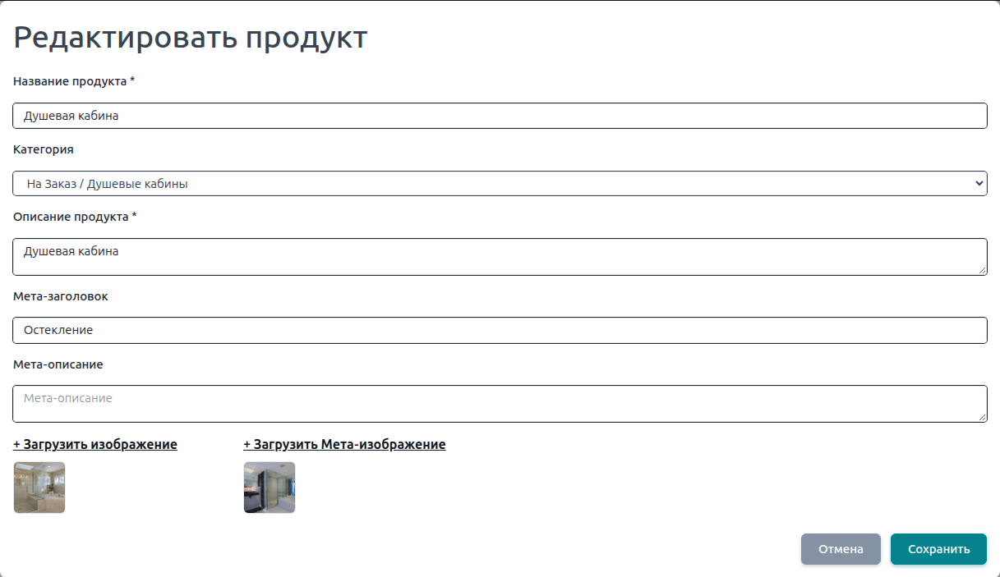

# StekloGrad

Corporate website and content management system for a company specializing in custom glass structures and interior solutions.

🌐 Live Demo: https://steklo-grad.ru

---

## Preview

### Desktop



### Tablet



### Mobile



---

## About

StekloGrad is a full-stack web application developed for a glass manufacturing company with more than 10 years of industry experience.

The project consists of a public-facing website and an administrative dashboard for managing products, services, galleries, media content, customer reviews, contacts, and SEO settings.

The company specializes in:

- Glass shower cabins
- Glass partitions
- Mirrors
- Glass doors
- Interior glass structures
- Custom glass products

The platform allows administrators to manage website content through a dedicated CMS while providing customers with a responsive and user-friendly interface.

---

## Features

### Public Website

- Product catalog
- Services catalog
- Customer reviews
- Contact information
- Privacy policy page
- Responsive design
- Interactive gallery
- Video gallery
- Contact request form

### Content Management System

- Categories management
- Products management
- Services management
- Gallery management
- Video management
- Reviews management
- Contact information management
- SEO metadata management

### Media Features

- Image upload and storage
- Video hosting via Cloudinary
- Automatic video thumbnail generation
- Fancybox image gallery
- Swiper sliders

### SEO

- Dynamic page titles
- Meta descriptions
- Dynamic Open Graph tags
- Custom Open Graph images
- Semantic HTML structure
- SEO-friendly URLs
- Search engine indexing support

### Communication

- Contact form processing
- Email notifications
- Yandex SMTP integration
---

## Gallery

The project includes a media gallery with support for image albums, video content, and full-screen previews powered by Fancybox.

### Gallery Overview



### Fancybox Preview



### Gallery Features

- Image albums
- Full-screen image viewing
- Video gallery support
- Responsive gallery layout
- Album-based media organization
- Smooth user experience across devices

---

## Admin Panel

The administrative dashboard is built using customized Sneat Dashboard components and provides a centralized interface for content management.

### Products Management



### Product Editing



### CMS Capabilities

Administrators can manage:

- Categories
- Products
- Services
- Image galleries
- Video galleries
- Customer reviews
- Contact information
- SEO metadata

### Content Management Features

- Create, update and delete content
- Media upload and management
- SEO configuration
- Visibility controls
- Slug generation
- Dynamic content rendering
---
## Tech Stack
### Backend

- Laravel
- PHP
- MySQL 8
- Redis

### Frontend

- Blade Templates
- JavaScript (Vanilla JS)
- Tailwind CSS
- Vite

### UI & Libraries

- Swiper
- Fancybox
- Boxicons
- Sneat Dashboard UI

### Media & Integrations

- Cloudinary
- Yandex SMTP

### Infrastructure

- Docker
- Docker Compose
- Nginx
- Redis
- MySQL

---

## Architecture

The application is containerized using Docker Compose and consists of four main services:

| Service | Description |
|----------|-------------|
| App | Laravel application running inside a custom PHP container |
| Nginx | Reverse proxy and web server |
| MySQL | Primary relational database |
| Redis | Caching and queue support |

### Docker Services


- app
- nginx
- mysql
- redis


### Infrastructure Features

- Containerized development environment
- Persistent MySQL storage
- Persistent Redis storage
- Nginx reverse proxy
- Isolated Docker network
- Environment-based configuration

---

## Email Integration

The project uses SMTP-based email delivery through Yandex Mail.


### Supported Actions

- Contact form notifications
- Customer inquiries
- Administrative notifications

---

## Installation

### Requirements

* Docker
* Docker Compose

---

### 1. Clone the repository

```bash
git clone https://github.com/NikaPepo/steklo-grad
cd steklograd
```

---

### 2. Create environment file

```bash
cp .env.example .env
```

Configure the required environment variables:

* Database credentials
* SMTP credentials
* Cloudinary credentials

---

### 3. Build and start containers

```bash
docker compose up -d --build
```

---

### 4. Install dependencies

```bash
docker compose exec app composer install
```

---

### 5. Generate application key

```bash
docker compose exec app php artisan key:generate
```

---

### 6. Run database migrations and seed demo data

```bash
docker compose exec app php artisan migrate --seed
```

---

### 7. Create storage symlink

```bash
docker compose exec app php artisan storage:link
```

---

### Application

The application will be available at:

```text
http://localhost
```


---
## Author

Developer: Nikita Pepanyan

Project: StekloGrad

Website: https://steklo-grad.ru
